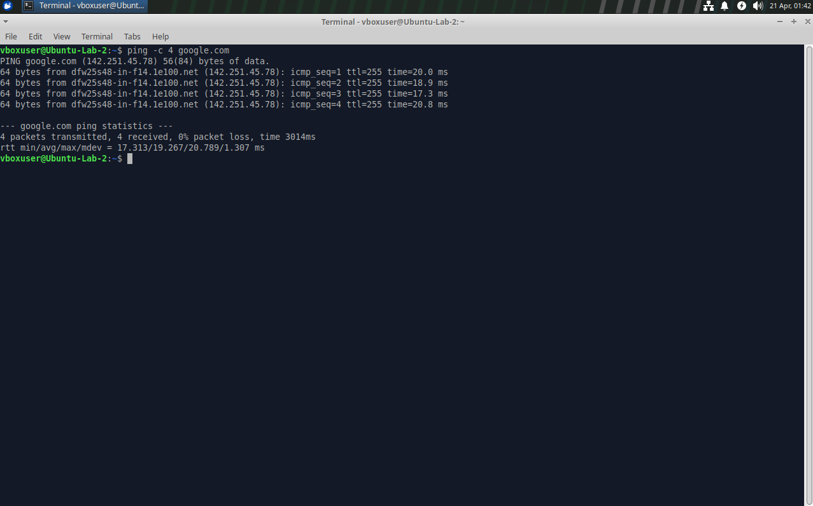
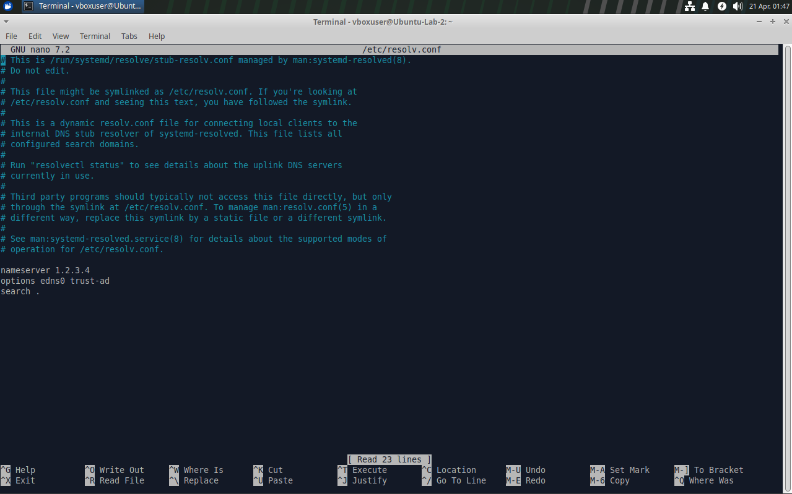
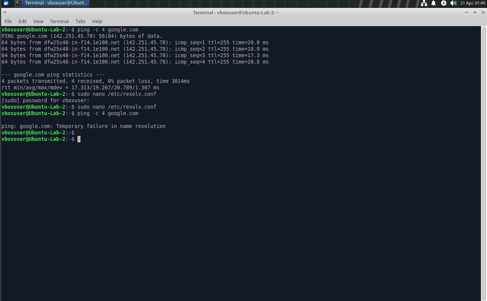
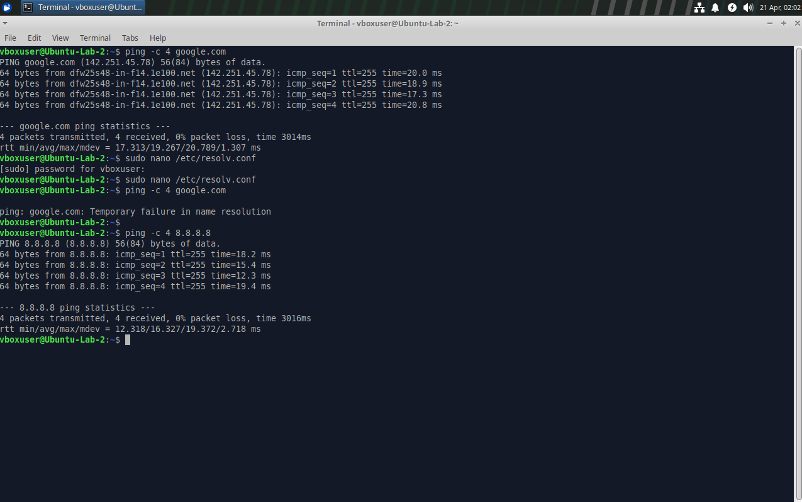
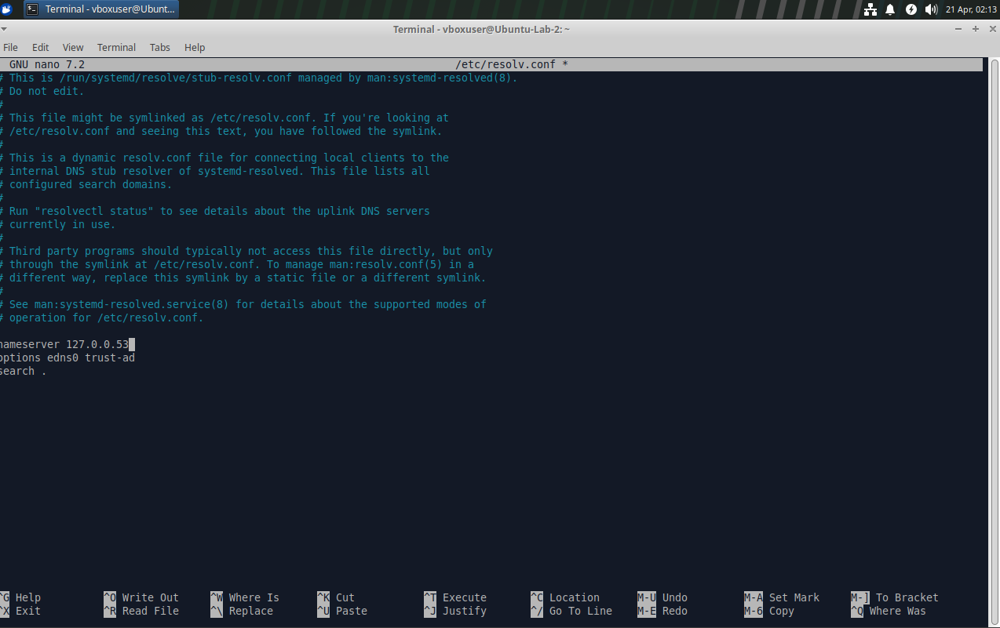
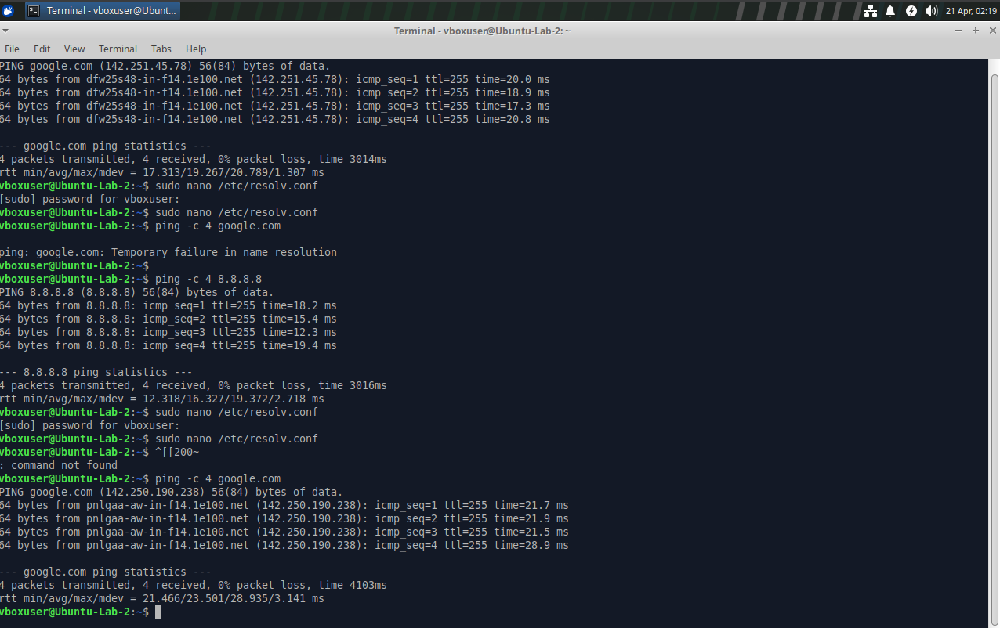

# 🛠️ Linux DNS Troubleshooting Lab

## 📌 Objective
This lab demonstrates how DNS works by intentionally breaking and restoring DNS configuration in a Linux environment.

---

## 🧪 Lab Overview
In this lab, I simulated a real-world issue where internet connectivity exists, but domain name resolution fails.

---

## 🛠️ Tools Used
- Ubuntu (Virtual Machine)
- Linux Terminal
- Nano Text Editor
- Ping Utility

---

## 🔍 Steps Performed

### 1. Verified Baseline Connectivity
Ensured DNS resolution was working before making any changes.

```bash
ping -c 4 google.com
```
---

### 2. Broke DNS Configuration
Edited `/etc/resolv.conf` and changed the nameserver to an invalid IP.

---

### 3. Observed DNS Failure
```bash
ping -c 4 google.com
```
Result: Temporary failure in name resolution

---

### 4. Verified Internet Connectivity (IP)
```bash
ping -c 4 8.8.8.8
```

---

### 5. Restored DNS Configuration
Reverted nameserver to:
```
127.0.0.53
```

---

### 6. Verified Resolution Works Again
```bash
ping -c 4 google.com
```
## 📸 Screenshots

### Baseline (Working DNS)


### DNS Misconfigured


### DNS Failure


### IP Connectivity Still Works


### DNS Restored


### Final Verification

